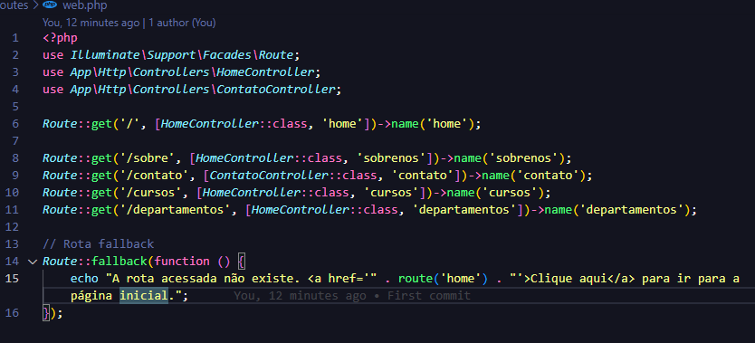
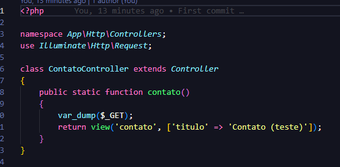
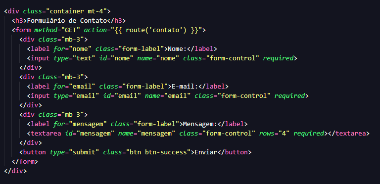

# SITE_ETEC - Atividade Laravel

## 📌 Requisitos
- PHP instalado
- Composer instalado
- MySQL rodando
- VS Code como editor de código

---

## 🚀 Prints da Atividade

- Tela Contato

- Rota Fallback

- Codigo

